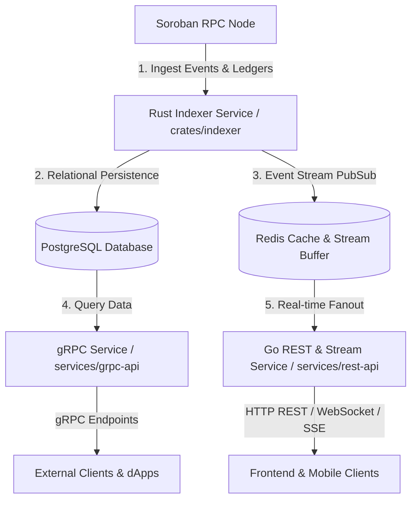

# Trident Framework Architecture Overview

## Overview

Trident is a high-throughput event indexing and query infrastructure for Stellar and Soroban smart contract ecosystems. It ingests block headers, ledger metadata, and Soroban contract execution logs from Soroban RPC nodes, normalizes binary XDR events, persists relational state into PostgreSQL, caches hot stream buffers in Redis, and exposes query interfaces via gRPC and HTTP REST APIs with WebSockets/SSE streaming.

---

## High-Level Architecture

---

## Component Breakdown

### 1. Ingest & Processing Engine (`crates/indexer`)
- **Streamer (`crates/indexer/src/streamer`)**: Polls Soroban RPC `getEvents` and `getLedgers` endpoints using configurable topic filters. Handlers mitigate network latency and handle transient RPC errors.
- **Parser (`crates/indexer/src/parser`)**: Decodes Soroban contract events from binary XDR format into structured domain models. Includes native Stellar Asset Contract (SAC) recognition and SEP-41 event parsing (`crates/indexer/src/parser/sac.rs`).
- **Store (`crates/indexer/src/store`)**: Manages transactional writes to PostgreSQL and publishes live event payloads to Redis Pub/Sub channels.

### 2. Storage Tier
- **PostgreSQL**: Serves as the primary source of truth for historical ledger events, contract deployment registries, and asset metadata.
- **Redis**: Acts as an in-memory event buffer for real-time WebSocket fanout and temporary deduplication of block range processing.

### 3. Service Tier
- **gRPC API (`services/grpc-api`)**: High-performance Rust gRPC service providing typed Protobuf contracts for contract event listing, ledger querying, and streaming.
- **Go REST API (`services/rest-api`)**: Go-based API server providing RESTful HTTP endpoints (`/v1/events`, `/v1/ledgers`), OpenAPI documentation, CORS middleware, and Server-Sent Events (SSE) / WebSocket endpoints for real-time updates.

### 4. Client SDK (`sdk/`)
- Client libraries providing typed interfaces for consuming Trident gRPC and REST streams with automatic reconnection logic and signature verification.

---

## Data Pipeline Flow

1. **Poll**: The Indexer polls the target Soroban RPC endpoint for new ledger events matching registered topic filters.
2. **Decode**: Binary XDR event payloads are decoded, enriched with ledger sequence numbers and timestamps, and checked against the `SacRegistry`.
3. **Persist**: Decoded event records are written to PostgreSQL tables.
4. **Publish**: Event payloads are published to Redis channels.
5. **Serve**: External clients query historical data via REST/gRPC or subscribe to live WebSocket/SSE event streams.
